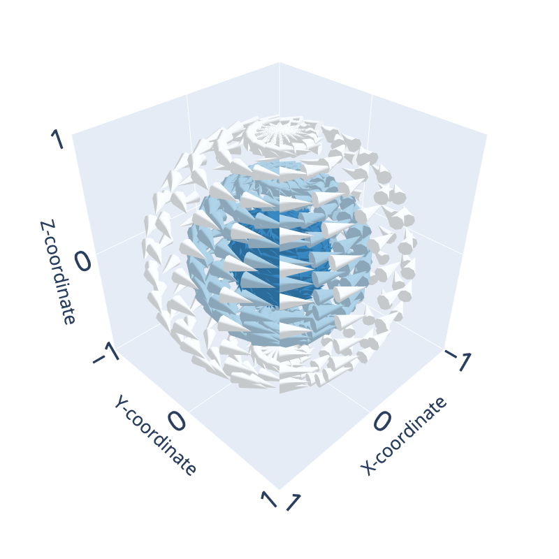

# Quantum-Wave-Simulation-with-Sources-and-Loss-Functions

> Open-source, 3D Wave equation solver with sources, loss functions, and boundary conditions

  
  
  

> Figure 1: Initialized radially symmetric quantum state. The subplots show vector fields constructed from an initial state in [1,0,0] direction with purely X-, Y-, or Z- vector components.

## Overview
Quantum computers show potential for solving wave based forward and inverse problems with major runtime advantages.

We present numerical implementations for educational purposes together with our publication [Quantum Wave Simulation with Sources and Loss Functions (11/2023)]:

### Quantum Encoding:
1. A **solver for the 2D acoustic wave equation** that utilizes a natural quantum encoding.
2. A **solver for the 3D Maxwells equations** that utilizes a natural quantum encoding.

### Loss Functions:
3. An **optimally efficient estimation** of the **energy** and the **comparison and combination of wave fields** encoded as quantum states.
4. An **estimation of subspace comparisons, energies, and combinations of wave fields** encoded as quantum states.

### Sources:
5. An implementation of **multiple synchronized pulse sources** into the wave equation as a quantum state.
6. An implementation of **asynchronous pulse source terms** into the wave equation as a quantum state.

### Implementation:
7. A **full wave quantum wave simulation implementation with sources, boundary conditions, and loss functions** using the open-source toolkit [Qiskit](https://arxiv.org/abs/2312.14747/).
8. A quantum circuit implementation for **efficient vector field initialization** used in **implementing arbitrary source terms**.

Enjoy your quantum wave evolution experiments!

# 

> Figure 2: Quantum circuit for efficient vector field initialization in 3D. The initial ray is prepared in the quantum register $initial$ with vector components saved in the register $dim$. The registers $grid_{2D}$ (and $grid_{3D}$) are transformed into a state of equal superposition. Afterwards (multi-)controlled RY rotations are applied with decreasing angles, which gives the rotationally symmetric vector field in the combined registers.
